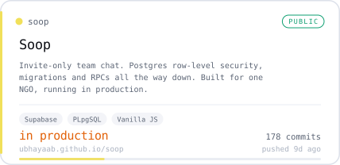
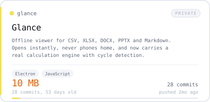
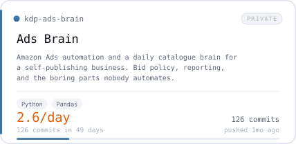

  <a href="https://ubhayaab.github.io">
    <picture>
      <source media="(prefers-color-scheme: dark)" srcset="./assets/hero-dark.svg">
      <source media="(prefers-color-scheme: light), (prefers-color-scheme: no-preference)" srcset="./assets/hero-light.svg">
      
    </picture>
  </a>

  <a href="https://ubhayaab.github.io"><b>ubhayaab.github.io</b></a>
  &nbsp;·&nbsp;
  <a href="./play/ttt.md">play tic-tac-toe</a>
  &nbsp;·&nbsp;
  <a href="#the-draft">play the draft</a>
  &nbsp;·&nbsp;
  <a href="./data/stats.json">stats as JSON</a>

<!-- BEGIN:PROSE -->
37 repositories, 26 of them public, 1,536 commits between them.
Mostly C++ 29%, JavaScript 27%, Python 10%, across 21 languages and 50 MB of tracked source.
77 active days in the last year, longest run 16.
24% of commits land between 23:00 and 06:00, and the single busiest hour of the week is
Sunday at 01:00.
Last push 6 hours ago to [`UbhayAab`](https://github.com/UbhayAab/UbhayAab) - `chore: rebuild profile [skip ci]`.
<!-- END:PROSE -->

## Work

<!-- BEGIN:CARDS -->
<table width="100%">
<tr>
<td width="50%" valign="top">
<a href="https://github.com/UbhayAab/llama.cpp-ubhay">
<picture>
<source media="(prefers-color-scheme: dark)" srcset="./assets/card-llama.cpp-ubhay-dark.svg">
<source media="(prefers-color-scheme: light), (prefers-color-scheme: no-preference)" srcset="./assets/card-llama.cpp-ubhay-light.svg">
 llama.cpp: Personal fork of ggml-org/llama.cpp, tracking upstream. Porting per-layer embeddings so the model fits a card it was never sized for." src="./assets/card-llama.cpp-ubhay-light.svg" width="100%">
</picture>
</a>
</td>
<td width="50%" valign="top">
<a href="https://github.com/UbhayAab/soop">
<picture>
<source media="(prefers-color-scheme: dark)" srcset="./assets/card-soop-dark.svg">
<source media="(prefers-color-scheme: light), (prefers-color-scheme: no-preference)" srcset="./assets/card-soop-light.svg">

</picture>
</a>
</td>
</tr>
<tr>
<td width="50%" valign="top">
<a href="https://github.com/UbhayAab/glance">
<picture>
<source media="(prefers-color-scheme: dark)" srcset="./assets/card-glance-dark.svg">
<source media="(prefers-color-scheme: light), (prefers-color-scheme: no-preference)" srcset="./assets/card-glance-light.svg">

</picture>
</a>
</td>
<td width="50%" valign="top">
<a href="https://github.com/UbhayAab/kdp-ads-brain">
<picture>
<source media="(prefers-color-scheme: dark)" srcset="./assets/card-kdp-ads-brain-dark.svg">
<source media="(prefers-color-scheme: light), (prefers-color-scheme: no-preference)" srcset="./assets/card-kdp-ads-brain-light.svg">

</picture>
</a>
</td>
</tr>
</table>

3 of these four are private repositories. The links are real; they will 404 unless you have access.

<!-- END:CARDS -->

<!-- BEGIN:DRAFT -->
## The Draft

A real next-token distribution from `llama3.1:8b`, measured on the machine described above.
No model runs to serve this page: the probabilities were computed once and committed, so the
game has no runtime at all.

> Row level security in Postgres is enforced by the **___**

Which token does the model rank first? Open one to find out.

<code>setting</code>

**No.** `setting` is rank 5 at 5.5%. The model wanted `security` at 66.5%.

| rank | token | probability | surprisal |
|---|---|---|---|
| 1 | `security` | 66.5% | 0.59 bits |
| 2 | `row` | 14.6% | 2.78 bits |
| 3 | `'` | 7.1% | 3.82 bits |
| 4 | `policy` | 6.4% | 3.97 bits |
| 5 | `setting` | 5.5% | 4.19 bits |

<code>row</code>

**No.** `row` is rank 2 at 14.6%. The model wanted `security` at 66.5%.

| rank | token | probability | surprisal |
|---|---|---|---|
| 1 | `security` | 66.5% | 0.59 bits |
| 2 | `row` | 14.6% | 2.78 bits |
| 3 | `'` | 7.1% | 3.82 bits |
| 4 | `policy` | 6.4% | 3.97 bits |
| 5 | `setting` | 5.5% | 4.19 bits |

<code>security</code>

**Correct.** The model's top token, at **66.5%** of the visible mass, carrying 0.59 bits.

| rank | token | probability | surprisal |
|---|---|---|---|
| 1 | `security` | 66.5% | 0.59 bits |
| 2 | `row` | 14.6% | 2.78 bits |
| 3 | `'` | 7.1% | 3.82 bits |
| 4 | `policy` | 6.4% | 3.97 bits |
| 5 | `setting` | 5.5% | 4.19 bits |

<code>'</code>

**No.** `'` is rank 3 at 7.1%. The model wanted `security` at 66.5%.

| rank | token | probability | surprisal |
|---|---|---|---|
| 1 | `security` | 66.5% | 0.59 bits |
| 2 | `row` | 14.6% | 2.78 bits |
| 3 | `'` | 7.1% | 3.82 bits |
| 4 | `policy` | 6.4% | 3.97 bits |
| 5 | `setting` | 5.5% | 4.19 bits |

<code>policy</code>

**No.** `policy` is rank 4 at 6.4%. The model wanted `security` at 66.5%.

| rank | token | probability | surprisal |
|---|---|---|---|
| 1 | `security` | 66.5% | 0.59 bits |
| 2 | `row` | 14.6% | 2.78 bits |
| 3 | `'` | 7.1% | 3.82 bits |
| 4 | `policy` | 6.4% | 3.97 bits |
| 5 | `setting` | 5.5% | 4.19 bits |

Today's puzzle carries **1.55 bits** of entropy out of a possible
2.32, which is the polite way of saying the model is not confident either.
A new one appears every day.

**[All 30 puzzles](./play/draft.md)** if one is not enough.

<!-- END:DRAFT -->

## Two games in here, and neither has a runtime

**[Tic-tac-toe](./play/ttt.md)** is the whole game tree, pre-rendered as nested
disclosure triangles. Of the 569 games reachable from the empty board, 386 end
with the computer winning and 183 end in a draw. None end with you winning. A
draw is a perfect score.

**[The Draft](#the-draft)** is above: 30 real next-token distributions measured
from a model running on the machine described below, committed as data and
rendered as reveals.

Neither one runs a server, a GitHub Action, or a line of JavaScript. That was
the constraint, not a limitation. A game with no runtime cannot be rate limited,
cannot 503, and will still work in ten years.

## When the commits land

  <picture>
    <source media="(prefers-color-scheme: dark)" srcset="./assets/rhythm-dark.svg">
    <source media="(prefers-color-scheme: light), (prefers-color-scheme: no-preference)" srcset="./assets/rhythm-light.svg">
    
  </picture>

Not a contribution calendar and not a snake. Every square is a real commit
timestamp bucketed by weekday and hour in `Asia/Kolkata`, so it shows when the
work actually happens rather than how green a year looked.

<!-- BEGIN:BENCH -->

<b>What actually runs on an 8 GB card, measured</b>

Every number below came off the laptop this profile is maintained on, today.
Nothing is quoted from a spec sheet and nothing is estimated.

**Method.** ollama /api/generate, temperature 0, num_predict 160, 2 runs per model, first run discarded as cold. VRAM residency read back from /api/ps after load, not inferred from file size. Every model reported zero bytes resident in VRAM, so these are CPU numbers. Generation throughput and prompt throughput are
reported separately, because averaging them together is how people accidentally
publish flattering numbers.

| Model | Params | Quant | On disk | In VRAM | Generation tok/s | Prompt tok/s |
|---|---|---|---|---|---|---|
| `llama3.1:8b` | 8.0B | Q4_K_M | 4.92 GB | **0%** | **9.81** | 264 |
| `deepseek-r1:8b` | 8.2B | Q4_K_M | 5.23 GB | **0%** | **9.22** | 194 |
| `gemma4:e2b` | 5.1B | Q4_K_M | 7.16 GB | **0%** | **23.81** | 493 |
| `deepseek-r1:14b` | 14.8B | Q4_K_M | 8.99 GB | **0%** | **5.2** | 116 |
| `gemma4:e4b` | 8.0B | Q4_K_M | 9.61 GB | **0%** | **13.17** | 375 |

**The finding: file size does not predict throughput.** `gemma4:e2b` is
**2.2 GB larger on disk** than `llama3.1:8b`
and still generates **2.4x faster**
(23.81 vs 9.81 tok/s).

Bytes on disk are parameters plus embeddings. Throughput is set by how many of
those parameters have to be touched per token, which is a much smaller number
when a model keeps most of its capacity in per-layer embeddings rather than in
the dense stack. That gap is the entire argument for the
[Gemma 4 PLE port](#work): an architecture that decouples stored capacity from
per-token compute is worth more on a small card than any quantisation trick
applied to a dense model.

**The result I did not go looking for.** Every model in this run reported
`size_vram = 0`. The NVIDIA GeForce RTX 5060 Laptop GPU is sitting right there with 8 GB
and driver 595.95, and the runtime logged `offloaded 0/43 layers to GPU`
with an empty `GPULayers:[]`.

So the table above is CPU throughput on a machine with a perfectly good unused GPU in it.
The obvious move was to publish these as GPU numbers and never mention it. They are labelled
as what they are instead, because a page that only reports its wins is a brochure.

The likely cause is a runtime built against a CUDA version with no kernels for this card's
compute capability, which is a normal thing to hit on a new architecture and a normal thing
to fix by updating the runtime. It is being fixed. The numbers here will be re-measured and
this paragraph will change, which is the point of generating the page from a script rather
than typing it.

Measured 09 Aug 2026 14:59 IST on NVIDIA GeForce RTX 5060 Laptop GPU, 8 GB VRAM, driver 595.95. Raw output including
every run: [`data/bench.json`](./data/bench.json).
Reproduce with [`scripts/bench-local.mjs`](./scripts/bench-local.mjs).

<!-- END:BENCH -->

<b>Gemma 4 PLE into llama.cpp: what the port actually involves</b>

Gemma 4 ships per-layer embeddings. Upstream `llama.cpp` has no concept of
them, so running the model locally at full quality means the format, the
loader and the graph all have to learn a new idea rather than just a new
tensor name.

The work splits into three parts, in the order they have to happen:

1. **Format.** Teach the GGUF converter to emit the per-layer embedding
   tensors with stable names and the metadata needed to reconstruct their
   layout on load.
2. **Loader.** Map those tensors into the model struct, validate shapes
   against the layer count, and fail loudly on mismatch rather than producing
   quiet garbage.
3. **Graph.** Inject the per-layer contribution at the right point in the
   forward pass, for every backend that matters here (CPU and CUDA first).

The fork tracks `ggml-org/llama.cpp` upstream so the diff stays reviewable and
the eventual PR is a rebase rather than an archaeology project.

<b>How this README builds itself</b>

Every image on this page is generated by a script in this repo and committed as
a plain file. Nothing here is fetched from a third-party image service at read
time, so nothing here can 503.

That is not a stylistic preference. At the time this was built,
`github-readme-stats.vercel.app` returns **503 DEPLOYMENT_PAUSED** and is
formally deprecated, and `github-profile-trophy.vercel.app` returns
**402 DEPLOYMENT_DISABLED**. Both are embedded in hundreds of thousands of
profile READMEs, and every one of them is currently showing a broken image.
The failure mode of a committed SVG is "slightly stale". The failure mode of a
hotlinked one is a dead profile you are not looking at.

The pipeline:

| Step | Script | What it does |
|---|---|---|
| 1 | [`gen-stats.mjs`](./scripts/gen-stats.mjs) | A handful of GraphQL calls. Writes [`data/stats.json`](./data/stats.json) and appends one line to [`data/history.jsonl`](./data/history.jsonl). |
| 2 | [`gen-hero.mjs`](./scripts/gen-hero.mjs) | The banner. The wordmark is hand-authored stroke geometry, so there is no font to embed and nothing to fall back to. |
| 3 | [`gen-rhythm.mjs`](./scripts/gen-rhythm.mjs) | The 7x24 heatmap, bucketed through `Intl` in the right timezone. |
| 4 | [`gen-cards.mjs`](./scripts/gen-cards.mjs) | Project cards. Prose from [`data/projects.json`](./data/projects.json), every number from `stats.json`. |
| 5 | [`lint-svg.mjs`](./tools/lint-svg.mjs) | Hard gate. Rejects any asset with a poisoned number, an external reference, a duplicate id, unbalanced tags, no `viewBox`, or no reduced-motion block. |
| 6 | [`splice.mjs`](./scripts/splice.mjs) | Fills the marked regions of [`README.tpl.md`](./README.tpl.md) and writes this file. |

Three details that are easy to get wrong and hurt when you do:

- **A `NaN` in an SVG attribute is invisible.** You get a well-formed file that
  renders as empty space, with no error in the console and no error in the
  build log. `lint-svg.mjs` fails the run instead.
- **Firefox always resolves the light branch** of a `<picture>` inside an
  ``-loaded SVG, and GitHub's own theme toggle does not affect
  `prefers-color-scheme` at all. A mismatch is guaranteed for some readers, so
  both variants paint their own opaque background. Worst case you get a light
  card on a dark page, which is a look, not a bug.
- **Animated SVG is not wrapped in GitHub's image player**, so it ignores
  `prefers-reduced-motion` unless the file honours it directly. Every asset
  here does, and every animation runs *from* a hidden state so that turning
  motion off shows the finished artwork rather than an empty box.

The [asset preview harness](./tools/preview.html) renders every generated file
against both GitHub page backgrounds at once, including the Firefox case.

<!-- BEGIN:REPOS -->

<b>Every repository, 37 of them</b>

Sorted by commits. Private ones are listed because leaving them out makes the
work look thinner than it is; their links are omitted rather than dangled.

| Repo | Language | Commits | Size | Last push | |
|---|---|---|---|---|---|
| [`Priyanka_joshi`](https://github.com/UbhayAab/Priyanka_joshi) | JavaScript | 628 | 285 MB | 2025-03-27 |  |
| [`JCF`](https://github.com/UbhayAab/JCF) | JavaScript | 151 | 191 MB | 2026-08-11 |  |
| [`trackerz`](https://github.com/UbhayAab/trackerz) | JavaScript | 131 | 18 MB | 2026-08-14 |  |
| `kdp-ads-brain` private | Python | 126 | 15 MB | 2026-08-08 | Amazon Ads automation and daily catalogue brain for KDP books |
| `illustrated-book-content-engine` private | Python | 119 | 2.3 GB | 2026-08-03 | Illustrated book content engine for AI storybook production and Canva handoff. |
| `public-complaint-hub` private | TypeScript | 102 | 602 KB | 2025-04-13 |  |
| [`UbhayAab`](https://github.com/UbhayAab/UbhayAab) | JavaScript | 47 | 748 KB | 2026-08-19 | Config files for my GitHub profile. |
| [`kdp-ads-dashboard`](https://github.com/UbhayAab/kdp-ads-dashboard) | HTML | 39 | 379 KB | 2026-08-13 | KDP ads dashboard |
| `glance` private | JavaScript | 28 | 10 MB | 2026-08-09 | An elegant, fast, offline viewer for CSV, Excel, Word, PowerPoint and Markdown on Wi |
| [`EyeTracker`](https://github.com/UbhayAab/EyeTracker) | Python | 27 | 106 MB | 2026-02-21 | Tried something |
| [`hearth-web`](https://github.com/UbhayAab/hearth-web) | HTML | 26 | 646 KB | 2026-07-27 |  |
| [`soop`](https://github.com/UbhayAab/soop) | JavaScript | 25 | 1.2 MB | 2026-08-11 | Soop - invite-only team chat. A Redtree product. |
| [`kpicomp`](https://github.com/UbhayAab/kpicomp) | TypeScript | 25 | 217 KB | 2025-09-05 |  |
| [`MeeshoLod`](https://github.com/UbhayAab/MeeshoLod) | JavaScript | 23 | 332 KB | 2026-08-11 |  |
| `hearth` private | JavaScript | 21 | 117 MB | 2026-07-28 |  |
| `continuity` private | Python | 21 | 207 KB | 2026-07-18 |  |
| `carcinome_wp` private | TypeScript | 11 | 964 KB | 2026-07-25 |  |
| [`UbhayAab.github.io`](https://github.com/UbhayAab/UbhayAab.github.io) | JavaScript | 9 | 297 KB | 2026-08-12 | Landing page. Hand-rolled WebGL2, five playable games, every number measured. |
| [`EggAplha`](https://github.com/UbhayAab/EggAplha) | HTML | 8 | 46 KB | 2026-02-20 |  |
| [`maya-bridge-demo-canva-artifact`](https://github.com/UbhayAab/maya-bridge-demo-canva-artifact) | - | 7 | 60 MB | 2026-05-31 | Public Canva import artifact for Maya and the Tiny Bridge prototype |
| [`Nexus`](https://github.com/UbhayAab/Nexus) | Kotlin | 7 | 1.2 MB | 2025-10-05 |  |
| [`Ngo_SafaltaSetu`](https://github.com/UbhayAab/Ngo_SafaltaSetu) | HTML | 6 | 177 KB | 2025-12-10 |  |
| [`robotics`](https://github.com/UbhayAab/robotics) | JavaScript | 5 | 266 KB | 2026-05-17 |  |
| [`MegaSeleniumBot`](https://github.com/UbhayAab/MegaSeleniumBot) | Jupyter Notebook | 5 | 141 MB | 2025-07-21 |  |
| [`Meloaa`](https://github.com/UbhayAab/Meloaa) | HTML | 4 | 64 KB | 2026-02-25 | Assignment |
| [`JCF-Gda31885`](https://github.com/UbhayAab/JCF-Gda31885) | CSS | 3 | 960 KB | 2024-11-05 |  |
| [`AyuSSm`](https://github.com/UbhayAab/AyuSSm) | Python | 2 | 31 KB | 2025-05-11 |  |
| [`whatsapp_automation`](https://github.com/UbhayAab/whatsapp_automation) | JavaScript | 2 | 259 KB | 2025-04-19 |  |
| [`EmailScraper_JCF`](https://github.com/UbhayAab/EmailScraper_JCF) | Python | 1 | 79 KB | 2026-03-26 | Tried something |
| [`Ubhay`](https://github.com/UbhayAab/Ubhay) | JavaScript | 1 | 662 KB | 2026-02-28 |  |
| [`Neemans`](https://github.com/UbhayAab/Neemans) | CSS | 1 | 22 KB | 2026-02-17 | Assigntment |
| `llama.cpp-ubhay` private | C++ | 1 | 32 MB | 2026-06-01 | Personal clone of ggml-org/llama.cpp for upstreaming Gemma4 PLE port (upstream track |
| `cleanedemails` private | Python | 1 | 32 KB | 2026-05-16 | Two-tier email cleaning pipeline: Gemini Flash classifies, Gemini Pro / DeepSeek + D |
| `Ollama-gemma4` private | Python | 1 | 21 KB | 2026-05-16 | Local Gemma4 PLE benchmarking with llama.cpp on RTX 5060; capture_oracle + bench scr |
| `Midjourney-bot` private | Python | 1 | 15 KB | 2026-05-16 | Discord-driven Midjourney automation: prompt batching, downloader, prompt matrix gen |
| `KDP-bot` private | Python | 1 | 183 KB | 2026-05-16 |  |

<!-- END:REPOS -->

<!-- BEGIN:FOOTER -->
---

Generated 20 Aug 2026 00:22 IST from 5 GraphQL points in 7.3s.
Run #46. Rebuilds every 6 hours and on every push.
 
<b>This run could not see 12 private repositories</b>, so their numbers are carried
forward from 19 Aug 2026 18:37 rather than dropped.
 
Every image on this page is generated by <a href="./scripts">a script in this repo</a> and committed as a file.
Nothing is fetched from a third-party image service, so nothing here can break when one of them goes down.
 
Machine-readable: <a href="./data/stats.json">stats.json</a> &middot; <a href="./data/history.jsonl">history.jsonl</a> &middot; <a href="./data/bench.json">bench.json</a>

<!-- END:FOOTER -->
