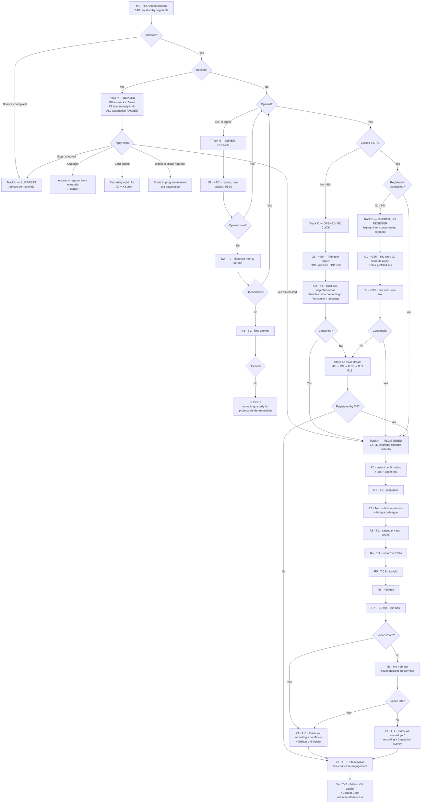

# Horizon VII — Campaign Plan
### "Colorectal Cancer: From Evidence to the Real World"

---

## 1. Event snapshot

| Field | Value |
|---|---|
| Series | **Horizon** — A Global Collaborative Forum on Cancer Care |
| Edition | **VII** |
| Theme | Colorectal Cancer: From Evidence to the Real World |
| Date | **Saturday, 26 September** |
| Time | **7:00 PM – 9:00 PM IST** (2 hours) |
| Format | Online via Zoom |
| Cost | Free |
| Host | Jarurat Care Foundation |
| Institutional partners | AIIMS New Delhi · National Cancer Institute, Nagpur |
| Supported by | Zydus · Merck |
| T-0 | 26 Sept, 19:00 IST |

**Faculty**

| Role | Name | Affiliation | Session |
|---|---|---|---|
| International Keynote | **Dr. Arvind Dasari** | Professor, GI Med Onc, MD Anderson, Houston | Advances in Colorectal Cancer (7:15–7:45) |
| Co-Chair | **Dr. Milind Javle** | Prof. & Clinical Medical Director, GI Med Onc, MD Anderson | Open + Close, panels |
| Co-Chair | **Dr. Sewanti Limaye** | Dir. Medical & Precision Oncology, Sir HN Reliance, Mumbai | Open + Close, panels |
| Co-Chair | **Dr. Atul Sharma** | Chairman, Med Onc, Max Super Speciality, Saket | Panels |
| Co-Chair | **Dr. Anand Pathak** | Medical Director & Head Med Onc, NCI Nagpur | Case Presentation 1 (7:45–7:55) |
| Case presenter | **Dr. Nikhil Vasudeva** | Med Onc, B.R.A. IRCH, AIIMS New Delhi | Case Presentation 2 — Cetuximab (8:20–8:30) |
| Industry | **Mr. Jay Kothari** | President, Zydus Lifesciences; Director, Zynext Ventures | Biosimilars in India (8:10–8:20) |
| Advocacy | **Ms. Priyanka Joshi** | Jarurat Care Foundation | Patient Advocacy & the Cancer Care Journey (7:05–7:15) |

---

## 2. Campaign identity

**Campaign name (internal):** `HZN7-CRC-SEP26`

**Public campaign line (use on every asset):**
> **From Evidence to the Real World.**
> Two real cases. Six experts. Two hours. 26 September, 7 PM IST.

**Positioning — the one sentence everything ladders up to:**
> The trial data on colorectal cancer is published everywhere. What isn't published is what six senior oncologists actually *do* when the patient in front of them doesn't match the trial population, the biosimilar costs a third as much, and the family is paying out of pocket. That's the two hours.

**Three proof pillars** (rotate these; never send an email without at least one):
1. **Access** — MD Anderson GI faculty, live, free, from your living room, on a Saturday.
2. **Realism** — two unscripted real-world cases + 30 minutes of open panel disagreement, not a slide dump.
3. **India-context** — biosimilars, cost, access, and patient-side reality via AIIMS, NCI Nagpur, Max Saket, Sir HN Reliance and Jarurat Care.

**Sender setup** *(confirm before build)*

| Field | Value |
|---|---|
| From name | `Horizon · Jarurat Care Foundation` |
| From address | `{{HORIZON_FROM_EMAIL}}` — dedicated subdomain, e.g. `horizon@mail.<domain>` |
| Reply-to | `{{HORIZON_REPLY_TO}}` — **a real, monitored human inbox**, not no-reply |
| Personal-touch sends (E-O2, E-N2, Track P) | From an individual: `Priyanka Joshi · Jarurat Care` |
| Physical address in footer | Required for CAN-SPAM/GDPR compliance |

**Rule: `no-reply@` is banned in this campaign.** The entire reply branch (Track P) depends on people being able to answer.

---

## 3. Segments

### 3a. Entry segments (who goes into the campaign)

| Code | Segment | Source | Est. behaviour |
|---|---|---|---|
| **S1** | Past Horizon attendees (Ed. I–VI) | Zoom registrant exports | Highest open/convert. Treat as VIP. |
| **S2** | Past registrants who never attended | Zoom no-show lists | Warm, need a friction fix, not persuasion |
| **S3** | Jarurat Care clinician network | CRM | Warm |
| **S4** | Partner-institution lists (AIIMS, NCI Nagpur, Max, Sir HN Reliance) | Partner-shared, opt-in only | Medium |
| **S5** | Cold oncology list (DM/DNB residents, med onc, surg onc, GI) | Owned list only | Low open. Never buy a list — it will burn the domain. |
| **S6** | Patients / caregivers / advocacy volunteers | Jarurat Care community | Separate copy — see §9 |
| **S7** | Sponsor & partner internal teams (Zydus, Merck) | Manual | Manual invite, not automated stream |

### 3b. Behavioural tracks (where they go after E1)

| Track | Trigger | Intent read | Objective |
|---|---|---|---|
| **R — Registered** | Registration form submit | Converted | Get them to actually *show up* + bring a colleague |
| **C — Clicked, no register** | Clicked CTA, no form submit within 24h | High intent, friction problem | Remove friction |
| **O — Opened, no click** | Opened ≥1 email, zero clicks, 48h elapsed | Interested, not convinced | Give one concrete reason |
| **N — Never opened** | 0 opens across 2+ sends | Subject-line / deliverability problem | Change subject, sender, daypart |
| **P — Replied** | Any human reply | Highest value signal in the campaign | Human answers within 4h, stream pauses |
| **U — Suppressed** | Unsub, bounce, complaint | Out | Remove immediately, permanently |

**Hard rule:** a contact is in exactly **one** track at a time. Entering R, P or U **immediately exits** every other track. No one gets "we missed you" after they've registered. That single bug kills more campaigns than bad copy.

---

## 4. The journey at a glance

Legend: **M** = main broadcast · **R** = registered · **O** = opened-no-click · **C** = clicked-no-register · **N** = never-opened · **P** = replied

| # | T-minus | Date (2026) | Day | Time IST | Audience | Working title |
|---|---|---|---|---|---|---|
| **M1** | T-18 | Tue 8 Sep | Tue | 11:00 | All entry segments | **The Announcement** — "Colorectal cancer, from evidence to the real world" |
| **M2** | T-14 | Sat 12 Sep | Sat | 10:30 | Unregistered | **The Keynote** — Dr. Arvind Dasari, MD Anderson |
| **M3** | T-12 | Mon 14 Sep | Mon | 19:30 | Unregistered | **The Run of Show** — full agenda, minute by minute |
| **M4** | T-10 | Wed 16 Sep | Wed | 11:00 | Unregistered | **The Room** — who you'll be sitting with |
| **M5** | T-8 | Fri 18 Sep | Fri | 18:00 | Unregistered | **The Cases** — "Case 2 is a cetuximab problem" |
| **M6** | T-5 | Mon 21 Sep | Mon | 11:00 | Unregistered | **The Cost Conversation** — biosimilars + patient reality |
| **M7** | T-4 | Tue 22 Sep | Tue | 19:00 | **All** (incl. registered) | **Ask the Experts** — submit your question |
| **M8** | T-3 | Wed 23 Sep | Wed | 11:00 | Unregistered | **The Track Record** — six editions so far *(past-editions block)* |
| **M9** | T-2 | Thu 24 Sep | Thu | 18:30 | Unregistered | **48 Hours** — registration closing |
| **M10** | T-1 | Fri 25 Sep | Fri | 19:00 | Unregistered | **Tomorrow, 7 PM** — final call |
| **M11** | T-0.5 | Sat 26 Sep | Sat | 10:00 | Unregistered | **Tonight at 7** — last chance to grab a seat |
| **M12** | T-0 | Sat 26 Sep | Sat | 18:00 | Unregistered | **Doors open in 60 minutes** *(walk-in registration)* |
| — | — | — | — | — | — | — |
| **R0** | instant | on signup | — | +0 min | Registered | **Confirmation** — you're in + calendar + Zoom link |
| **R1** | T-7 | Sat 19 Sep | Sat | 11:00 | Registered | **Prep Pack** — the 3 questions to bring |
| **R2** | T-4 | Tue 22 Sep | Tue | 19:00 | Registered | **Bring a colleague** (referral) *(merged with M7)* |
| **R3** | T-2 | Thu 24 Sep | Thu | 18:30 | Registered | **Calendar check** + tech test |
| **R4** | T-1 | Fri 25 Sep | Fri | 19:00 | Registered | **Tomorrow, 7 PM IST — your link** |
| **R5** | T-0.5 | Sat 26 Sep | Sat | 10:00 | Registered | **Tonight** — agenda + link |
| **R6** | T-0 −60m | Sat 26 Sep | Sat | 18:00 | Registered | **We go live in 60 minutes** |
| **R7** | T-0 −15m | Sat 26 Sep | Sat | 18:45 | Registered | **Join now** — one line, one button |
| **R8** | T-0 +20m | Sat 26 Sep | Sat | 19:20 | Registered **no-shows only** | **You're missing the keynote right now** |
| — | — | — | — | — | — | — |
| **C1** | +24h after click | rolling | — | — | Clicked, no register | **You were 30 seconds away** |
| **C2** | +72h after click | rolling | — | — | Still not registered | **Two lines, one link** |
| **O1** | +48h after open | rolling | — | — | Opened, no click | **"Is it the timing or the topic?"** |
| **O2** | T-6 | Sun 20 Sep | Sun | 20:00 | Persistent openers | **The objection email** — plain text, from a person |
| **N1** | +72h after M1 | Fri 11 Sep | Fri | 08:00 | Never opened | **Resend, new subject, new daypart** |
| **N2** | T-9 | Thu 17 Sep | Thu | 09:00 | Still never opened | **Plain-text, one question, from a human** |
| **N3** | T-2 | Thu 24 Sep | Thu | 12:00 | Still never opened | **Final attempt, then sunset** |
| — | — | — | — | — | — | — |
| **P0** | instant | rolling | — | +5 min | Anyone who replies | **Auto-acknowledge** (once per contact) |
| **P1** | ≤4 business hrs | rolling | — | — | Anyone who replies | **Human reply** — see §8 playbook |
| — | — | — | — | — | — | — |
| **X1** | T+1 | Sun 27 Sep | Sun | 11:00 | Attended | **Thank you** + recording + certificate |
| **X2** | T+1 | Sun 27 Sep | Sun | 11:00 | Registered no-show | **Sorry we missed you** + recording |
| **X3** | T+3 | Tue 29 Sep | Tue | 11:00 | Everyone engaged | **5 takeaways from Horizon VII** |
| **X4** | T+7 | Sat 3 Oct | Sat | 11:00 | Full engaged list | **What's next** — Edition VIII waitlist + Jarurat Care ask |

**Total sends any one person receives:** 5–9 (unregistered, depending on track) · 8–10 (registered). Never more than 3 in the final week for an unregistered contact.

---

## 5. Branch logic (the actual decision tree)



### 5a. Machine-readable trigger rules

| Rule | Condition | Action |
|---|---|---|
| TR-01 | `reply_received = true` | Pause ALL automation for contact. Tag `replied`. Fire P0. Create human task, SLA 4 business hours. |
| TR-02 | `registration_completed = true` | Exit M, O, C, N. Enter R. Tag `registered`, stamp `reg_date`. |
| TR-03 | `clicked = true AND registered = false AND hours_since_click >= 24` | Enter Track C. Send C1. |
| TR-04 | `in_track_C AND registered = false AND hours_since_C1 >= 48` | Send C2. Then return to main stream. |
| TR-05 | `opened >= 1 AND clicked = 0 AND hours_since_open >= 48 AND registered = false` | Enter Track O. Send O1. |
| TR-06 | `in_track_O AND opened_O1 = true AND clicked = 0` | Send O2 at T-6, 20:00 IST. |
| TR-07 | `opens_total = 0 AND sends >= 1 AND hours_since_send >= 72` | Enter Track N. Send N1 — **new subject line, 08:00 daypart**. |
| TR-08 | `opens_total = 0 AND N1_sent AND now >= T-9` | Send N2 — plain text, personal from-name. |
| TR-09 | `opens_total = 0 AND N2_sent AND now >= T-2` | Send N3, then set `status = sunset`. **Remove from all future Horizon broadcasts** until they re-engage. |
| TR-10 | `unsubscribed OR hard_bounce OR spam_complaint` | Suppress permanently. No further sends of any type, including "sorry to see you go". |
| TR-11 | `registered = true AND zoom_joined = false AND event_elapsed_min >= 20` | Send R8. |
| TR-12 | `registered = true AND zoom_joined = false AND event_ended` | Tag `no_show`. Send X2, not X1. |
| TR-13 | `zoom_joined = true` | Tag `attended`, store `minutes_attended`. Send X1. Certificate only if `minutes_attended >= 60`. |
| TR-14 | `soft_bounce_count >= 3` | Convert to suppression. |
| TR-15 | `sends_in_rolling_7d >= 3 AND registered = false` | **Hold** next send 24h. Frequency cap wins over schedule. |
| TR-16 | `segment = S6 (patients/caregivers)` | Route to patient-copy variant of every send. Never send clinician case-teaser copy. |

---

## 6. Send-time logic

| Daypart | IST | Use for | Why |
|---|---|---|---|
| Early | 08:00–09:00 | Track N resends | Different daypart = different inbox position. If 11:00 didn't work, 08:00 might. |
| Late morning | 11:00 | Main announcements, weekend sends | Post-rounds, pre-OPD-peak lull |
| Evening | 18:00–19:30 | Case teasers, reminders, final calls | Post-OPD. Highest clinician engagement window. |
| Night | after 21:30 | **Never** | Reads as spam, tanks reputation |

**Weekend logic:** the event *is* on a Saturday evening, so Saturday sends are on-brand here (M2, M11, R1, R5). Sunday is used only for the soft, personal O2 send at 20:00.

**Frequency caps**
- Unregistered: max **2 emails / 7 days** until T-7, max **3 / 7 days** in the final week.
- Registered: reminders are transactional-adjacent — cap does not apply, but R6/R7 are one line each.
- Anyone in Track P: **0 automated sends** until the human conversation closes.

---

## 7. Global email anatomy

Every single email in this campaign ships with these elements:

1. **Preheader text** — set explicitly, never let it inherit the first line of the body.
2. **Logo lockup** — Jarurat Care + Horizon at top. AIIMS / NCI in the partner strip.
3. **Event stamp block** — always visible without scrolling:
   > **26 SEPT · 7:00–9:00 PM IST · Online via Zoom · Free**
4. **One primary CTA**, repeated max twice (once above fold, once at end). Same wording both times.
5. **Faculty visual** — at least one face. Faces raise CTR in medical-education email.
6. **Past-editions block** — `{{PAST_EDITIONS_BLOCK}}`, see `04-past-editions-placeholder.md`.
7. **Partner / supporter strip** — Zydus, Merck as **"Supported by"** (not endorsement — see §11).
8. **Footer**, mandatory on every send:

```
You're receiving this because you registered for a previous Horizon edition
or opted in to Jarurat Care Foundation updates.

Get fewer emails  ·  Only Horizon invites  ·  Unsubscribe
   [preference centre]      [preference centre]   [one-click]

Jarurat Care Foundation
{{REGISTERED_POSTAL_ADDRESS}}
{{WEBSITE}}  ·  {{REPLY_TO_EMAIL}}
```

**On unsubscribe:** offer a **preference centre**, not a binary. Three doors — "fewer emails", "Horizon invites only", "unsubscribe from everything". A large share of would-be unsubscribes take door 1 or 2. One-click unsubscribe header (`List-Unsubscribe`) is still mandatory alongside it.

---

## 8. Metrics — targets and what to actually watch

| Metric | Cold (S5) | Warm (S1–S4) | Read it as |
|---|---|---|---|
| Delivery rate | >97% | >98% | <95% = list hygiene problem, stop and clean |
| Open rate | 18–25% | 35–50% | Inflated by Apple MPP — use as a directional signal only |
| Click rate (CTR) | 1.5–3% | 5–9% | **This is the real interest metric** |
| Click-to-open (CTOR) | 8–12% | 15–22% | Measures whether the *body* is working |
| Registration rate (of delivered) | 0.8–2% | 4–8% | The number that matters |
| Reply rate | 0.2% | 1–2% | Every reply is a warm lead — treat as gold |
| **Registration → attendance** | **35–45%** | **45–60%** | The reminder stream (R4–R7) is what moves this |
| Unsubscribe rate | <0.4% | <0.2% | >0.5% on any single send = pull the next send and rewrite |
| Spam complaints | <0.08% | <0.05% | >0.1% = stop the campaign immediately |

**Diagnostic rule of thumb:**
- Low open, low click → **subject line / sender / deliverability** problem → Track N tactics
- High open, low click → **body and offer** problem → Track O tactics
- High click, low register → **form friction** problem → Track C tactics + shorten the form
- High register, low attendance → **reminder stream** problem → tighten R4–R7

**Registration form: keep it to 4 fields.** Name · Email · Speciality/Role · Institution. Every extra field costs conversion. Phone number is optional at most; make it optional or drop it.

---

## 9. Patient / caregiver variant (segment S6)

Jarurat Care's community includes patients and families. **Do not send them clinician copy.** Cetuximab case teasers and biosimilar market talk will land badly on someone mid-treatment.

Send them **one** email at T-7 and **one** at T-1, framed on Ms. Priyanka Joshi's 7:05 PM session:

> **Subject:** A seat at the table on 26 September
> **Body angle:** This is a doctors' forum, and it's open to you. At 7:05 PM, Jarurat Care's Priyanka Joshi speaks on what the cancer care journey actually looks like from the patient's side — to a room of oncologists from MD Anderson, AIIMS, NCI Nagpur and Max. You're welcome to listen. Much of the rest of the evening is technical; come for the parts that help.

Set the expectation honestly so nobody joins expecting individual medical advice. Add one line: *"This session is educational and is not a substitute for advice from your own treating team."*

---

## 10. Build checklist

**T-20 → T-19 (pre-flight)**
- [ ] Export and dedupe all lists (S1–S7); suppress previous unsubs and bounces
- [ ] Verify sending domain: SPF, DKIM, DMARC aligned; dedicated subdomain warmed
- [ ] Set up `List-Unsubscribe` header + preference centre
- [ ] Registration form live, 4 fields, mobile-tested, thank-you page redirect working
- [ ] Zoom webinar created, registration link + auto-confirmation configured
- [ ] Tracking: UTMs on every link, registration goal in analytics
- [ ] Seed-test inbox list (Gmail, Outlook, Yahoo, corporate/hospital domain) — check spam placement
- [ ] Reply inbox monitored + Track P playbook printed for whoever staffs it
- [ ] `{{PAST_EDITIONS_BLOCK}}` filled with Editions I–VI
- [ ] All 30+ assets rendered in dark mode, and with images blocked

**Daily during campaign**
- [ ] 09:00 — check reply inbox, action Track P within SLA
- [ ] Check unsub + complaint rate on yesterday's send; pull the next send if over threshold
- [ ] Update registration count on the internal dashboard vs target

**T-1**
- [ ] Zoom link tested from a fresh device
- [ ] Backup link ready in case of Zoom failure; SMS/WhatsApp fallback list for registered
- [ ] Faculty confirmed and briefed on run of show
- [ ] Recording + certificate pipeline ready before the event, not after

**T+1**
- [ ] Attendance data pulled from Zoom, `attended` / `no_show` tagged within 12h
- [ ] Recording uploaded and gated (email capture) or ungated — decide in advance
- [ ] Certificates generated for ≥60 min attendees

---

## 11. Guardrails

Worth flagging once, because this campaign sits in a regulated space:

1. **The agenda includes a named product (cetuximab) and a biosimilars segment, with Merck and Zydus as supporters.** Keep all email copy **educational and non-promotional**. Describe the *clinical question*, never a product benefit. Sponsors appear as *"Supported by"* with logos only — no claims, no product names in subject lines attached to a brand.
2. **Never state or imply CME accreditation** unless it is actually accredited. If it is, name the accrediting body and credit hours. If not, say "certificate of participation".
3. **Consent.** Only send to lists with a lawful basis — prior registration, explicit opt-in, or existing relationship. Partner-shared lists must be opt-in at source. Do not buy lists.
4. **Patient data.** The two case presentations are real-world cases — confirm with the presenters that identifiers are removed before any case detail appears in marketing copy. Keep marketing descriptions non-identifying and generic.
5. **No individual medical advice** in any reply from the campaign inbox, especially in Track P replies from patients. Standard deflection line is in the Track P playbook.

---

*Files in this set:*
- `01-campaign-plan.md` — this file
- `02-email-copy.md` — every email, full copy, subject + preheader + body
- `03-automation-rules.md` — ESP-agnostic build spec, merge tags, UTM scheme
- `04-past-editions-placeholder.md` — the reusable block to fill with Editions I–VI
